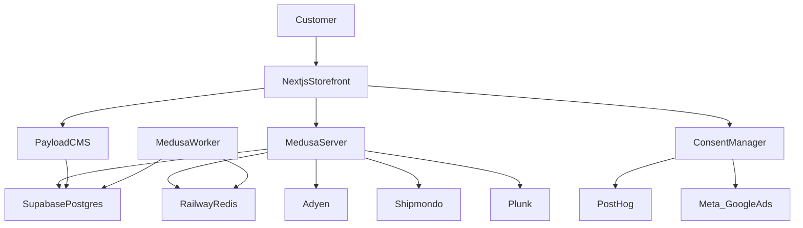

# Architecture

## System Overview
Guapo is a composable e-commerce system with:
- A **storefront** for customers (browse, guidance, checkout, account)
- A **commerce backend** for products/carts/orders/subscriptions
- A **CMS** for content, SEO fields, homepage composition, and guidance content
- Integrations for payments, shipping, email, analytics, and marketing pixels

The system is Denmark-first and supports `/da/...` and `/en/...` URL prefixes.

## Component Architecture
- **Frontend (Storefront)**:
  - Next.js application
  - Responsibilities: SEO pages, PLP/PDP, cart/checkout, account, subscriptions UI, content rendering, consent banner + consent-aware scripts

- **Backend/API (Commerce)**:
  - Medusa (commerce backend)
  - Responsibilities: product catalog, pricing, carts, checkout orchestration, orders, subscriptions lifecycle (skip/pause/resume/cancel gating), refunds (partial), inventory signals (when available)

- **CMS**:
  - Payload CMS
  - Responsibilities:
    - content pages + blog/articles
    - landing pages and homepage page builder (predefined section types)
    - navigation/footer links
    - PDP guidance content (skin types, concerns, routines content fields)
    - SEO fields and structured data inputs

- **External Services**:
  - Payments: Adyen (cards, Apple Pay, Google Pay, MobilePay, Klarna) + recurring for subscriptions
  - Shipping: Shipmondo (parcel shop only in MVP)
  - Transactional email: Plunk
  - Analytics: PostHog (behind analytics consent)
  - Marketing: Meta + Google Ads pixels (behind marketing consent)
  - Supplier (future): Qogita (investigation; decision later)

## Deployment topology (MVP)

Compute is hosted on Railway; PostgreSQL is hosted on Supabase; Redis is hosted on Railway.

Railway services (expected):
- Storefront: Next.js (`storefront`)
- Commerce API: Medusa server mode (`medusa-server`)
- Background jobs: Medusa worker mode (`medusa-worker`)
- CMS: Payload (`payload`)
- Redis: Railway managed Redis (`redis`)

Supabase:
- PostgreSQL database shared by Medusa + Payload (schema separation strategy documented in `spec/08-infrastructure.md`).

## Data Flow

### Browse → guidance → purchase (one-time)
- User browses PLP/PDP (Next.js)
- Storefront fetches product + pricing from Medusa; guidance content from Payload
- User adds items to cart → begins checkout
- Payment authorized/captured via Adyen
- Order created in Medusa
- Transactional emails via Plunk (order confirmation; shipping/tracking when available)

### Subscription purchase
- User selects subscription on PDP (cycle 4/8/12 weeks; 5% discount)
- Checkout processes initial order + recurring authorization (Adyen recurring)
- Medusa stores subscription schedule and customer controls (skip/pause/resume/cancel after 2 deliveries)

### Subscription renewal
- Upcoming renewal reminder (3 days before) via Plunk
- Renewal attempt via Adyen recurring
  - On failure: 2 retries over 3 days; notify failed and recovered states
  - If still failing: subscription placed on hold until payment method update
- On success: new order created; shipping/tracking emails when dispatched

### Returns/refunds and subscription impact
- Returns policy: 14 days; customer-paid return label; opened products excluded except defective
- Partial refunds supported per returned line item
- If a subscription delivery is refunded/returned: subscription auto-pauses until the customer resumes

### Consent-aware analytics/marketing
- Consent banner manages categories: necessary / analytics / marketing
- PostHog scripts load only after analytics consent
- Meta/Google Ads pixels load only after marketing consent

## Design Patterns
- **Composable commerce**: storefront + commerce backend + CMS separated by clear responsibilities
- **Decision logging**: product decisions captured in `spec/05-decisions.md`
- **Curation-first**: manual/editorial tagging with primary + secondary tags drives sorting and recommendations

## Technology Stack
See `spec/08-infrastructure.md` for the source of truth.

- Frontend Framework: Next.js
- Backend Framework: Medusa
- CMS: Payload CMS
- Database: PostgreSQL (Supabase)
- Cache/Queue: Redis (Railway)
- Language: TypeScript

## API Design (if applicable)
- Storefront consumes Medusa APIs for commerce and Payload APIs for content.
- Subscription/customer-control APIs must be deterministic and auditable (skip/pause/resume/cancel gating).

## Security Architecture (minimum)
- Secrets are stored as environment variables (no secrets in git)
- Consent-aware tracking (GDPR)
- Payment handled through Adyen; no storing of raw card data in Guapo systems

## Scalability Considerations
- Start with Denmark-first assumptions (currency/shipping)
- Keep i18n routing stable (`/da`, `/en`) for SEO
- Avoid indexing filter combinations by default (canonical to base category)

## CI/CD Architecture (if applicable)
TBD (to define during /spec/plan): CI checks, preview deployments, production release process.

